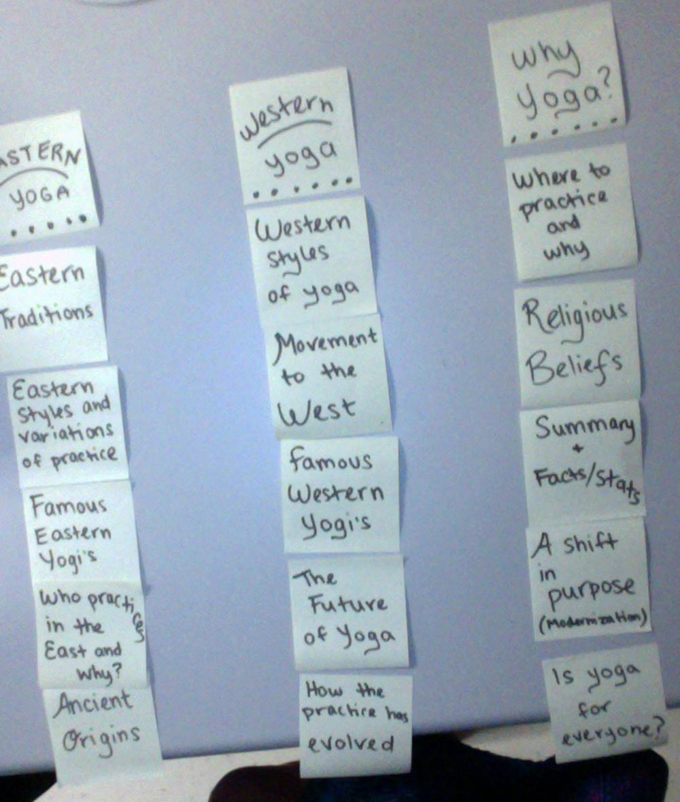
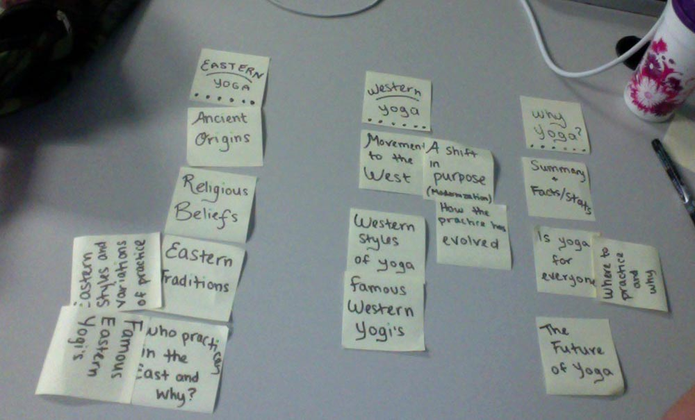

# Card sort report

The purpose of this card sort was to determine common navigation patterns and categories from the content of mt site Yoga Around the World.

## Specifics

The card sort was conducted by Emily Barclay on Sept.9th 2013 between the times of 10:00am and 10:30am with the following participants:

- Seita Goto
- Cassie Chartrand

### Cards

15 cards were used covering a broad range of applicable content for the website. The following topics were used as cards:

1. Eastern Traditions
2. Famous Eastern Yogis
3. Eastern Styles and Variations of Practice
4. Who practices in the East and why?
5. Ancient Origins
6. Western Styles of Yoga
7. Movement to the West
8. Famous Western Yogis
9. How the practice has evolved
10. Where to practice and why
11. A shift in purpose (modernization)
12. Is yoga for everyone?
13. Religious Beliefs
14. The Future of Yoga
15. Summary + Facts/Stats

## Card sort results

*Card sort 1 by Cassie Chartrand

*Card sort 2 by Seita Goto

## Observations

- Did the participants have any common comments?
	Both participants felt as though some of the topics could fit under more than one heading and were not sure which catergory to choose. 
	
- Did they have questions that stood out?
	N/A
	
- Did they struggle with certain articles or topics?
	Topics such as "The future of yoga", "How the practice has evolved" and "A shift in purpose (modernization)" could fall under the category "Western Yoga" as well as "Why yoga?".
	
- Did they find common groupings? Or were the groupings completely different?
	I provided 3 catergory headings and both participants were able to sort all of the cards into one of the 3 and they thought they worked well.
	
- Were some of the groupings completely unexpected?
	I was a little surpised when the first card sort had "Religious Beliefs" under the "Why yoga?" category because I knew it belonged under "Eastern Yoga" because the practice originated under various religious beliefs but this proved to me that not everyone knows as much as I do about yoga.
	
- Were the results similar to your expectations?
	Other than one or two unexpected card placings for the most part the results were what I was expecting and hoping for.
	
- How did you feel while watching them perform the task?
	I felt confident that I have chosen interesting topics and a wide variety of topics too. My participents showed little to no confusion and were able to sort my cards with ease. 

